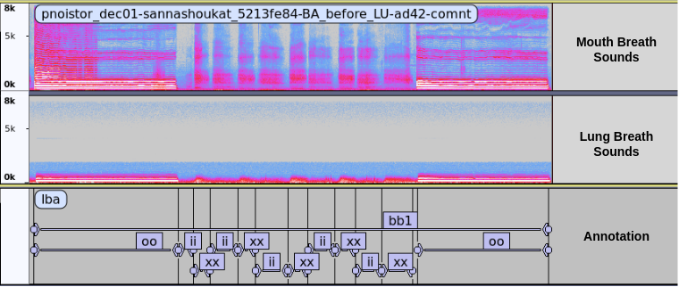

# Pnoi Corpus

## Description

The Pnoi Corpus is a collection of breath sounds recorded simultaneously from the mouth and chest of both healthy subjects and individuals diagnosed with asthma. The dataset also includes biodata, subject's response to a standard performa and pulmonary function test (PFT) reports. The recordings were captured using a Littmann CORE digital stethoscope and a Zoom H6 microphone. Sounds of Five breath were recored from Four different locations on the posterior chest. The data was collected at St. John Hospital, Pulmonary Health Science department.

For asthmatic subjects, a post recording was made ofter administering a bronchodilator. The post recording was made 15 minutes after the administration of the bronchodilator. The post recording was made to assess the effect of the bronchodilator on the subject's breathing sounds.

The dataset consists of 150 asthma patients and 150 control subjects, totaling 300 recordings. Each recording is accompanied by corresponding metadata, including demographic information, medical history, and the results of the PFT report.

---

Objective: To develope a model to predict PFT (Pulmonary Function Test) results from breath sounds recorded simultaneously from two locations, mouth and chest.


Fig. Basic data acquisition setup

Pnoi-phone: A biomedical device for recording breath sounds from the mouth and chest simultaneously.

---

## Data Statistics

- Total number of recordings: 300
  - Asthma patients: 150
  - Control subjects: 150

- Distribution of patients by gender:
  - Male: [Number]
  - Female: [Number]
  - Other: [Number]
  
- Age distribution:
  - Minimum age: [Age]
  - Maximum age: [Age]
  - Average age: [Age]
  - Median age: [Age]

- Additional statistics:
  - Average duration of breath sound recordings: [Duration]
  - Minimum duration: [Duration]
  - Maximum duration: [Duration]

---

## Data Organization

The dataset is organized into the following directories and files:

- `PNOI_CORPUS/`
  - `README.md`: This file.
  - `DATA/`
    - `[subject-ID]`: A folder for each subject consist of all relevant data.

      - `[subject-ID]_[location].wav`: Two channels audio recording of the subject's breathing sounds.

      - `[subject-ID]_[location].txt`: Text file containing annotations for the audio recording.

      - `[subject-ID].json`: JSON file containing metadata for the subject.

      - `[subject-ID].tsv`: TSV file containing the results of the PFT report for the subject.

---

## Data format

### Audio file

#### Nomenclature: seperated by \"-\"

- [`data_version`]: Month and Year of data collection
- [`subject-ID`]: Unique ID for each subject
- [`location`]: Location of the recording on the posterior chest
  - `BA`: "Breath Audio file tag",
  - `before/after`: "before" or "after" administration of bronchodilator
  - `location`:
    1. `LU`: "Left Upper Lobe",
    2. `RU`: "Right Upper Lobe",
    3. `LL`: "Left Lower Lobe",
    4. `RL`: "Right Lower Lobe",
- [`file-ID`]: Unique ID for each recording file
- [`comment`]: Additional information about the recording

The audio file contains TWO channels for breath sounds recorded simultaneously from the mouth and chest of the subject.

- Channel 0: Mouth
- Channel 1: Chest

`EXAMPLE`: pnoistor_oct07-amartyaveer_81b8f33c-BA_before_LL-c03e-lateupl.wav

### Annotation file

#### Nomenclature: Same as Audio file, but with `.txt` extension

- **values are tab separated.**

The annotation file contains the following information:

- `begin`: Start time of the annotation in seconds
- `end`: End time of the annotation in seconds
- `label`: Label of the annotation

`EXAMPLE`: pnoistor_oct07-amartyaveer_81b8f33c-BA_before_LL-c03e-lateupl.txt

#### Labels

The subjects are also requested to recite sustained phonation of the vowels /a/, /i/, /u/, and /o/ for 2-5 seconds. The annotation labels are as follows:


`bb[n]`: marks a single breathing session consisting of Five breaths recorded at a single location. n encodes the location of the recording.

#### File ID and Comments
  
- Are optional infornation to uniquely identify the file and add any comments about the recording.



Fig. Spectrogram showing two channels breath audio annotated with respective labels.

### Metadata file

#### Nomenclature: Same as Audio file, but with `.json` extension and with file tag `META`

JSON file contains metadata for the subject. The metadata includes:

`EXAMPLE`

```JSON
{
 "1": { "Q": "What is your smoking status?", "A": "Non-smoker" },
 "2": { "Q": "Do you have repeated episodes of cough?", "A": "Yes" },
 "3": {
  "Q": "How many times do you have cough and chest tightness?",
  "A": "1"
 },
 "4": { "Q": "How long does each episode last?", "A": "-" },
 "5": { "Q": "Have you been diagnosed with Asthma?", "A": "Yes" },
 "6": { "Q": "Wheeze and chest tightness present?", "A": "Yes" },
 "7": { "Q": "For how long is the symptom present? (days)", "A": "0" },
 "8": {
  "Q": "Do you experience episodic or continuous wheeze?",
  "A": "Episodic"
 },
 "9": { "Q": "Does your wheeze vary with seasons?", "A": "Yes" },
 "10": { "Q": "Does your wheeze vary across the day?", "A": "Yes" },
 "11": { "Q": "Do you have cough?", "A": "Yes" },
 "12": { "Q": "Do you have dry or wet cough?", "A": "Dry" },
 "13": { "Q": "Sputum color", "A": "-" },
 "14": { "Q": "Are you under any medication for asthma?", "A": "Yes" },
 "15": { "Q": "Do you use inhalers or nebulizers?", "A": "Inhalers" },
 "16": { "Q": "Do you have family history of asthma?", "A": "Yes" },
 "17": { "Q": "Do you have allergies?", "A": "Yes" },
 "18": { "Q": "Triggers for allergies?", "A": "Strong smells" },
 "19": { "Q": "Have you suffered from lung TB in the past?", "A": "No" },
 "20": { "Q": "Do you have any other respiratory illness?", "A": "No" },
 "21": { "Q": "Write in brief About it", "A": "-" },
 "22": { "Q": "Are you a known case of high blood pressure?", "A": "No" },
 "23": { "Q": "Your high blood pressure is", "A": "-" },
 "24": { "Q": "Are you a known case of diabetes?", "A": "No" },
 "25": { "Q": "Your diabetes is", "A": "-" },
 "26": { "Q": "Are you a known case of heart disease?", "A": "No" },
 "27": { "Q": "Any other health problems?", "A": "No" },
 "28": { "Q": "What other health problems?", "A": "-" },
 "29": {
  "Q": "Are you currently COVID-19 positive or have common cold?",
  "A": "No"
 },
 "30": {
  "Q": "Have you been COVID-19 positive or had cold in last 15 days?",
  "A": "No"
 },
 "firebaseId": { "Q": "firebaseId?", "A": "vijayaomkar_b866b679" },
 "subjectAge": { "Q": "subjectAge?", "A": "64" },
 "subjectGender": { "Q": "subjectGender?", "A": "Female" },
 "subjectHeight": { "Q": "subjectHeight?", "A": "153" },
 "subjectName": { "Q": "subjectName?", "A": "Vijaya Omkar" },
 "subjectRemunerationDetails": {
  "Q": "subjectRemunerationDetails?",
  "A": "X"
 },
 "subjectRemunerationType": {
  "Q": "subjectRemunerationType?",
  "A": "Account No."
 },
 "subjectSectionDone": { "Q": "subjectSectionDone?", "A": true },
 "subjectType": { "Q": "subjectType?", "A": "Patient" },
 "subjectWeight": { "Q": "subjectWeight?", "A": "59" }
}

```

### PFT Report

#### Nomenclature: Same as Audio file, but with `.json` extension and with file tag `PFT`

TSV file contains PFT report for the subject. The PFT report includes:
| PFT     | FEV1 | FVC  | ratio |
|---------|------|------|-------|
| **ref** | 1.58 | 1.91 | 77    |
| **val** | 1.48 | 1.63 | 91    |

- **ref**: Reference value (predicted value) for the subject
- **val**: Measured value for the subject
- **FEV1**: Forced Expiratory Volume in 1 second
- **FVC**: Forced Vital Capacity
- **ratio**: FEV1/FVC

---

## Disclaimer

The Pnoi Corpus is intended for research and educational purposes only. It is important to note that the dataset does not constitute medical advice or diagnosis. Users of this dataset are responsible for ensuring compliance with applicable ethical guidelines and regulations when using the data.
